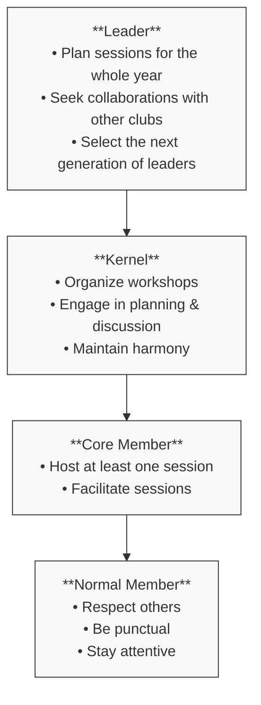

## History

### Legacy

Evan, Jinran, Dongyuan, and Wanbo were the great founders. They developed lots of awesome projects and infrastructures, including the classroom booking system which is still in use today. Most importantly, they created the atmosphere - courage to challenge and will to create.

That was the second year of Computing Society. There were really lots of members, due to their successful advertising skill. However, people got a bit disappointed, as the quality of the sessions were not so promising. I am not criticizing them here, because they were already DP2s who were busy with academic. Also, it was their first attempt to teach a big class, different from a small number of elites in the first year.

For me during that year, I not only learnt from the sessions, but also taught myself web development. [Webird](https://blog.gu33gu.asia/2024/07/29/How-I-built-Webird/) was developed in 6 months as the major achievement. [The Olympic sport website](https://blog.gu33gu.asia/2024/07/18/sport-csc-site-Re/) was a hustle, developed within 1 month, collaborated with Shane. Thanks Wanbo for introducing me to the Olympics Core team. Although the projects didn't reach viral popularity, they served real purposes and were used by dozens of students. More importantly, they inspired the structural reform of our club.

Time flies. The second year was over. Lots of members left gradually. The former leaders encouraged me to do what I trully enjoy before they graduated. This made me determined of renovating the zhixing, the club, thoroughly. Then it was my turn to change things.

### Pulling the Threads

Instead of big number of people and small number of elites, I chose a hybrid approach. We first ensure a group of elites who are capable of teaching and doing. Then based on the number of elites, we search for noobs, so that proportion of elites to members is at least 1:3. This makes the session smooth and simple to organize, while ensure members have sufficient opportunity to express, practice, and develop bondings.

I began seeking elites during summer holiday. For all the elites I knew, I contacted them on Wechat privately and persuade them to join. Just before the official annoucement of zhixing promotion, we had already got 8 elites from different fields, including Robotix, AI, Frontend Design, Assembly, etc. We originally planned to get 15 members in total.

It was time for the official promotion. At my insistence, we set up a Miku-themed promotion desk. Huge thanks to Hatti—one of the early members from the founding days—who helped a lot with the design and setup. Evan's reaction game was also a huge hit. Gorden put together a big signboard using tape and a basketball hoop. Posters were placed all around campus, along with a mystery bounty that challenged people to find the names of former leaders. Despite our best efforts, we didn't quite meet our original expectations—we ended up with 12 members. But we're determined to do better this year.

The sessions were carried out well. Members were active, at least they learnt new knowledge,  and some of them applied them to the real community. Here I would like to thank our advisor David. His quiet encouragement was crucial for the smoothness and our confidence.

## Responsibility

### Organization

The entire Zhixing is structured into two parts: **normal members** and the **core team**.  
Normal members include both **official** and **non-official** participants.  
The core team consists of **core members** and a group called the **Kernel**, with **leaders** being special members within the Kernel.

Each level carries the responsibilities of the previous ones:

- **Normal Members**: Show respect to others, be punctual, and stay attentive to sessions.
    
- **Core Members**: In addition to the above, they must host at least one session and actively help facilitate other sessions.
    
- **Kernel Members**: In addition to core member duties, they are responsible for organizing workshops, participating in planning and discussions, and maintaining a harmonious environment.
    
- **Leaders**: On top of Kernel responsibilities, they plan sessions for the entire year, pursue collaborations with other clubs, and are responsible for selecting the next generation of leaders.

Simple rules are developed to encourage members to showcase their talent. Anyone who is capable of hosting one session is qualified for the club core team, an honor recognized by the school. This simple rule not only reduced pressure of leaders who host routine sessions, but also foster breadth. Usually Kernels are fixed, but if a core member has great performance, the person is elligible for Kernel.

Learning from the past, we deliberately help develop leadership of next cohort by giving them more opportunities to lead external workshop and activities. After the leaders agreed on the future leaders selected from Kernels, the decision should be approved by most of the Kernels.

This year, the only 2 FPs (Richard and Harry) were anominated to become next leaders. Both were given opportunity and developed the Olympic sport website for this year together as core developers under limited guidance of me. Harry organized an AI workshop in STEAM week, and Richard actively maintained the booking system from Hattie.

### Sessions

> Sessions are key to boosting members' ability.

Sessions need to be interactive. It must be more intriguing and more effective than pure documentation. One way to achieve it is to add hands-on examples for the audience to operate. To make sure the professionals are not bored, additional challenging tasks are added for advanced learning.

Sessions do not need stylish slide, but documentation is required. Personally, using styled markdown is a good idea, as it fulfills both documentation and demonstration. After the sessions, the hoster should create session repositories from template. The aim of using a template is to ensure readability and reusability by making the format similar. It does not contain any style requirement, but only an additional overview is required.

I personally approve using AI to build tutorials, as it really saves lots of time. However, it should be noted that "vibe writing" is not a good idea. Hosters should verify all of the content and add their own voice into it.

There are two types of sessions: Routine Sessions and Featured Sessions. Routine sessions are hosted regularly by leaders. Featured sessions are hosted by core members or people who want to apply for core.

### Projects

> Projects are important. They transform our spirit into solid action via code.

When developing a project, FPs and DP1s are encouraged to take responsibility to lead, plan, and develop. DP2s should not take responsibility in most case due to their academic pressure.

The number of core developers involved in the projects should not exceed 2 people. This is the optimal number to develop a web application, tested by the Olympic sport website (both versions) and Archive. With more people, complexity will become harder to handle. More time will be wasted in coordination, and people may not be able to get into their zone.

The most ideal situation is that all members develop their own projects. Admittedly, it is hard to get all members to move. However, it is possible for the kernels to play a leading role. Harry and Richard were great examples. They developed the polished version of Olympics sport website for the school nearly from scratch. Action mind should be encouraged.

#### Collaboration

When collaborating with other clubs, we need to prevent loss of responsibility of the other club. For example, during hotspot website project, leader of the hotspot was a DP2 and was not responsive to the project at all. This wastes lots of time of our kernels. Therefore, we need to do investigation on the background of the collaborators to ensure they do not abandon the project half way.

Before collaboration, the designing form should be sent to the collaborators to request all the feature and style settings to ensure efficiency, assess feasibility, and determine tech stack.

#### Long Term

"Long Term" here means a project's core developers graduated. We currently do not have any experience in managing long-term projects, but this is going to happen soon. Currently I think of two options:
1. Let the core developer nominate one junior to replace his duty.
2. Let one kernel member take control of all the maintainance.

Those projects should be continuously managed:
- Booking System
- [MiniArchive](https://blog.gu33gu.asia/2025/03/22/CSC-Archive-Re/) for school newspaper *the Challenger*

#### Code Style

Be readable. Use GPT for annotation. Do not use confusing variable names.

### Documentation

After development of certain projects, we encourage members to write documents in addition to their code to enhance readability and reusability to practice open-source standard. Several tutorial projects were written and archived in our [club organization](https://github.com/Computing-Society-CSC) on github to allow future reuse and contribute to global open-source community.

I have a rough plan to migrate from github to Codeberg, considering Codeberg is more of legitamacy and safer.

## Thoughts

> "Empower UWC community with technology."

Inspired by my research on Richard Stallman's leadership in GNU, I came to understand that tools are important, but **creating the conditions for others to build** is even more powerful. I hoped to create a small community, where people with similar interest can focus on their projects and collaborate. The best thing in Computing Society is that an active member can enjoy not only from learning new technology, but also applying technology for the community's good.

"What zhixing builds that?"

I proudly answered: "Computing Society."

---

In the end, I intentionally denied any request for continuing my leadership in the clubs. I believe leadership is built on responsibility. It also means significant devotion to be an exemplar of others. Knowing that I will become a DP2 where academic pressure will force me to spend significantly less time and stamina on clubs, I realize I should leave the leadership opportunities to the next generation. Although not being the leader next year, I still wish to contribute to the clubs as much as I can, as a kernel member, not the leader.

> "**They gave me the courage to travel and taught me the joy of spending time with friends.**" — Frieren

